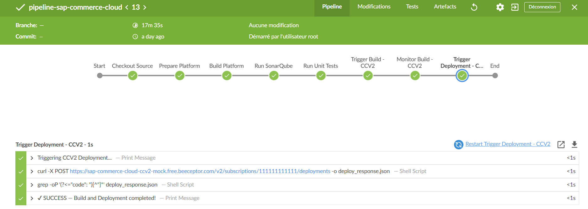

# Automating SAP Commerce Cloud with Jenkins, SonarQube & AI-powered Error Explanation

> This project provides a complete CI/CD pipeline for SAP Commerce Cloud (Hybris) using Jenkins, SonarQube, and Docker. It automates build, test, code quality analysis, and deployment to SAP Commerce Cloud (CCV2), with integrated AI-powered error explanations.

---

## 🖼️ Pipeline Overview

Below is a visual representation of the CI/CD pipeline:



---
## 🚀 Features
- **Containerized Environment:** Docker-based setup for Jenkins and SonarQube
- **Automated Build Pipeline:** End-to-end SAP Commerce platform build automation
- **Code Quality Analysis:** SonarQube integration for code quality checks
- **Unit Testing:** Automated test execution for custom extensions
- **CCV2 Integration:** Build triggering and deployment to Commerce Cloud
- **AI Error Explanation:** Plugin integration for intelligent build log and error analysis
- **Containerized Environment:** Docker-based setup for Jenkins and SonarQube
---

## 📋 Prerequisites

Before you begin, ensure you have the following:

- Docker & Docker Compose installed
- SAP Commerce Cloud platform zip file (e.g., `sap-commerce-suite-2211.zip`)
- SAP Commerce Cloud API credentials
- OpenAI or Google Gemini API key (for AI error explanation)

---

## 🛠️ Setup Instructions

### 1. Clone the Repository

```bash
git clone https://github.com/yourusername/automating-sap-cc-jenkins-sonar.git
cd automating-sap-cc-jenkins-sonar
```

### 2. Project Structure

```
automating-sap-cc-jenkins-sonar/
├── docker-compose.yml
├── jenkins/
│   ├── Dockerfile
│   └── plugins.txt
├── Jenkinsfile
└── README.md
```

### 3. Configure Platform Location

Update the platform zip path in `docker-compose.yml`:

```yaml
volumes:
  - D:/Platform_Hybris:/opt/platform_zip
```

Replace `D:/Platform_Hybris` with your actual SAP Commerce platform location.

### 4. Start the Environment

```bash
docker-compose up -d
```

This will start:
- Jenkins at [http://localhost:8080](http://localhost:8080)
- SonarQube at [http://localhost:9000](http://localhost:9000)

### 5. Configure Jenkins

#### Initial Setup

1. Access Jenkins at [http://localhost:8080](http://localhost:8080)
2. Get the initial admin password:
   ```bash
   docker exec jenkins cat /var/jenkins_home/secrets/initialAdminPassword
   ```
3. Install suggested plugins
4. Create your admin user

#### Add Credentials

Go to **Manage Jenkins → Credentials → System → Global credentials** and add:

- **CC_API_TOKEN** (Secret text)
  - ID: `CC_API_TOKEN`
  - Secret: Your SAP Commerce Cloud API token

#### Configure SonarQube

1. Access SonarQube at [http://localhost:9000](http://localhost:9000)
2. Default credentials: `admin/admin` (change on first login)
3. Generate a token: **Administration → Security → Users → Tokens**
4. In Jenkins: **Manage Jenkins → Configure System → SonarQube servers**
   - Name: `SonarQubeServer`
   - Server URL: `http://sonarqube:9000`
   - Server authentication token: Add the SonarQube token


   #### Configure Explain Error Plugin

1. Go to **Manage Jenkins → Configure System**
2. Find the **Explain Error Plugin Configuration** section.
3. Set the following options:

**Enable AI Error Explanation:**
   - Toggle plugin functionality (default: Enabled ✅)

**AI Provider:**
   - Choose between OpenAI, Google Gemini, or Ollama (default: OpenAI)

**API Key:**
   - Enter your AI provider API key
   - Obtain from OpenAI or Google AI Studio

**API URL:**
   - Specify the AI service endpoint
   - Leave empty for official APIs (OpenAI, Gemini)
   - Use a custom URL only for OpenAI-compatible services or air-gapped environments

**AI Model:**
   - Specify the model to use for analysis (e.g., gpt-4, gemini-pro)

4. Click **Test Configuration** to verify your setup.
5. Save the configuration.


---

## 6. Create Jenkins Pipeline

1. Click **New Item**
2. Enter name: `SAP-Commerce-Pipeline`
3. Select **Pipeline**
4. In Pipeline section:
   - Definition: Pipeline script from SCM
   - SCM: Git
   - Repository URL: Your repository URL
   - Script Path: `Jenkinsfile`

---

## 🔧 Configuration

### Environment Variables

Edit the `Jenkinsfile` to customize:

```groovy
environment {
    SONARQUBE_ENV = "SonarQubeServer"
    CC_API_URL = "your-ccv2-api-url"
    PLATFORM_ZIP = "/opt/platform_zip/sap-commerce-suite-2211.zip"
    TEST_PACKAGES = "de.hybris.platform.spartacussampledata.*"
}
```

#### Custom Test Packages
To test different packages, update `TEST_PACKAGES`:

```groovy
TEST_PACKAGES = "com.yourcompany.customextension.*"
```

---

## 📊 Monitoring & Reports

- Jenkins Dashboard: [http://localhost:8080](http://localhost:8080)
- SonarQube Dashboard: [http://localhost:9000](http://localhost:9000)
- Build Logs: Available in Jenkins build history

---

## 📝 Customization

### Adding More Plugins

1. Edit `jenkins/plugins.txt`:
   - your-plugin-name
   - another-plugin
2. Rebuild the Jenkins image:
   ```bash
   docker-compose build jenkins
   docker-compose up -d
   ```

---